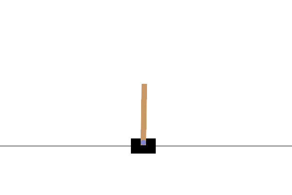

# DQN CartPole

Minimal, reproducible Deep Q-Network training and evaluation for `CartPole-v1` using PyTorch and Gymnasium.

This project started as a notebook experiment and was refactored into a small RL codebase with stable entrypoints, deterministic seeding, tests, and artifact generation. The goal is not to over-engineer CartPole; it is to show clean ML implementation discipline on a well-known benchmark.



## Why this repo exists

`CartPole-v1` is a small but useful benchmark for demonstrating reinforcement learning fundamentals:

- value-function approximation with a neural network
- experience replay
- target network updates
- epsilon-greedy exploration
- reproducible training and evaluation loops

For a portfolio project, the value is less about the benchmark itself and more about whether the implementation is coherent, runnable, and easy to review.

## Project structure

```text
src/dqn_cartpole/
  agent.py         DQN policy, learning step, target updates
  config.py        typed configuration for training/eval
  evaluate.py      checkpoint loading and deterministic evaluation CLI
  model.py         Q-network definition
  replay_buffer.py replay sampling utilities
  train.py         training loop and checkpoint/metrics writing
  utils.py         seeding, environment creation, JSON helpers
tests/
  unit + smoke tests for replay, agent, and CLI workflows
notebooks/
  demo notebook that imports package code instead of defining it
```

## Quickstart

### 1. Install

Recommended: use `uv`.

```bash
uv sync --extra test
```

If you prefer standard library tooling, use `venv`:

```bash
python -m venv .venv
source .venv/bin/activate
python -m pip install --upgrade pip
python -m pip install -r requirements.txt
```

### 2. Train

```bash
uv run python -m dqn_cartpole.train \
  --episodes 300 \
  --checkpoint-path artifacts/checkpoints/cartpole_dqn.pt \
  --metrics-path artifacts/train_metrics.json
```

If you used `venv`, run the same command after activating `.venv`, without `uv run`.

Training writes:

- the best checkpoint observed so far at `artifacts/checkpoints/cartpole_dqn.pt`
- machine-readable training metrics at `artifacts/train_metrics.json`
- console logs with episode reward, moving average reward, and epsilon

### 3. Evaluate

```bash
uv run python -m dqn_cartpole.evaluate \
  --checkpoint artifacts/checkpoints/cartpole_dqn.pt \
  --episodes 100 \
  --metrics-path artifacts/eval_metrics.json
```

If you used `venv`, run the same command after activating `.venv`, without `uv run`.

Evaluation reports:

- mean reward
- reward standard deviation
- per-episode rewards
- success rate against the CartPole solved threshold

## Design notes

- The training loop has a single source of truth: `agent.step(...)` owns replay insertion and learning cadence.
- The repo uses `gymnasium` instead of legacy `gym` and handles `terminated` / `truncated` correctly.
- Checkpoints store model weights, optimizer state, config, and summary metadata so evaluation can run independently from the training process.
- Tests focus on RL plumbing and workflow credibility rather than benchmark score chasing.

## Reproducibility

- Python, NumPy, Torch, and environment seeding are set explicitly.
- The default artifact paths are stable and suitable for CI smoke tests.
- `pytest` covers unit-level tensor shapes and a small end-to-end train/evaluate run.

Run the test suite with:

```bash
uv run pytest
```

If you used `venv`, run `pytest` after activating `.venv`.

## Demo notebook

The original notebook-heavy structure has been reduced to a thin demo notebook that imports the package code:

- [notebooks/cartpole_dqn_demo.ipynb](notebooks/cartpole_dqn_demo.ipynb)

Use it for exploration or quick inspection after installing the package in editable mode.

## Current limitations

- This is intentionally scoped to a single classic-control environment.
- There is no experiment tracker, hyperparameter sweeper, or GPU-specific optimization layer.
- Training variance still exists because DQN on short runs is sensitive to seed and budget; the repo records metrics rather than hiding that reality.
