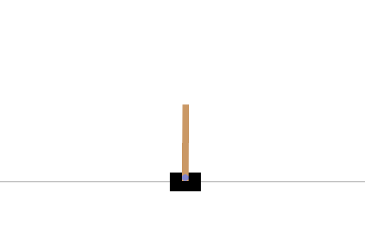

# Deep Q-Network (DQN) for CartPole

## Overview
This project demonstrates the implementation of a Deep Q-Network (DQN) to solve the CartPole-v1 environment from OpenAI Gym. By using reinforcement learning and PyTorch, this project showcases a deep understanding of machine learning techniques and their applications.

## Table of Contents
- [Technologies Used](#technologies-used)
- [Problem Statement](#problem-statement)
- [Solution Approach](#solution-approach)
- [Results](#results)
- [Dependencies and Requirements](#dependencies-and-requirements)
- [Instructions for Running the Code](#instructions-for-running-the-code)

## Technologies Used
- PyTorch
- OpenAI Gym

## Problem Statement
The goal of this project is to train a DQN agent to balance a pole on a cart for as long as possible. This classic control problem serves as a benchmark to evaluate the performance of reinforcement learning algorithms.

## Solution Approach
The solution uses a DQN agent with experience replay and target network. The key components of the project are:
- Q-Network: A neural network that approximates the action-value function.
- Replay Buffer: A data structure to store and sample past experiences for training.
- DQNAgent: A class that defines the agent's behavior, including action selection and learning.

The agent is trained using a variant of the Q-learning algorithm that incorporates deep learning for function approximation.

## Results

The trained agent achieved an average reward of 185.08 over 100 test episodes, demonstrating its ability to effectively solve the CartPole-v1 environment.

## Dependencies and Requirements
- PyTorch
- OpenAI Gym

## Instructions for Running the Code
1. Clone the repository.
2. Install the required dependencies.
3. Run the cells in the jupyter notebook: `dql-carpole.ipynb`

Feel free to explore and use this project as a starting point for further experimentation with reinforcement learning algorithms and their applications.
